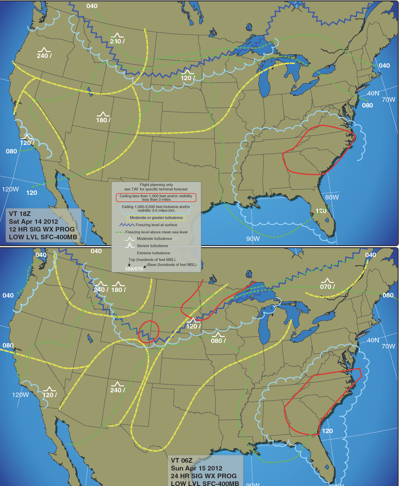

# Image Attachments Folder

This folder contains image attachments for exam questions. The exam application supports both single and multiple image attachments per question.

## File Organization
- Store all image files in this `/attachments/` folder
- Supported formats: `.png`, `.jpg`, `.jpeg`, `.gif`, `.svg`, `.webp`
- Keep files reasonably sized for web display (recommended: under 2MB each)

## File Naming Convention
Use descriptive names that relate to the question content:
- Include the question ID for easy reference
- Use clear, descriptive names
- Separate words with hyphens or underscores

### Examples:
- `question-45-airspace-chart.png`
- `question-78-weather-map.jpg`
- `question-120-aircraft-diagram.svg`
- `chart1.svg`, `chart2.png`, `diagram.jpg` (for multiple attachments)

## Usage in Questions

### Single Image Format
```json
{
  "id": 45,
  "question": "What type of airspace is depicted in the image?",
  "attachment": "question-45-airspace-chart.png",
  "type": "multiple-choice",
  "answers": ["Class B", "Class C", "Class D"],
  "correctAnswer": 1,
  "explanation": "..."
}
```

### Multiple Images Format
```json
{
  "id": 78,
  "question": "Based on the weather charts and diagrams shown...",
  "attachments": ["weather-chart1.png", "pressure-map.svg", "wind-diagram.jpg"],
  "type": "multiple-choice",
  "answers": ["Option A", "Option B", "Option C"],
  "correctAnswer": 0,
  "explanation": "..."
}
```

## Display Behavior
- **Single Image**: Displayed centered below the question text
- **Multiple Images**:
  - 1 image: Centered (same as single)
  - 2 images: Side-by-side grid
  - 3+ images: Responsive grid layout
- **All Images**: Click to enlarge in full-screen modal

## Best Practices
1. **Optimize for Web**: Compress images without losing quality
2. **Use SVG**: Recommended for charts and diagrams
3. **Descriptive Names**: Make filenames meaningful
4. **Test on Mobile**: Ensure images display well on all devices
5. **Relevance**: Only include images that enhance question understanding

## Sample Files
- `sample-airspace-chart.svg`: Example aviation chart showing airspace configuration
- Add your own image files following the naming conventions above